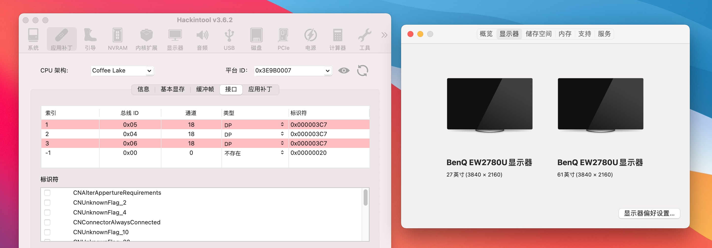

# GIGABYTE-B360M-AORUS-PRO
技嘉GIGABYTE B360M AORUS PRO i5-8500 UHD630 的 OpenCore 黑苹果 EFI 配置文件。

| 配件 | 型号                              |
| ---- | --------------------------------- |
| CPU  | i5-8500                           |
| 显卡 | Intel UHD 630 核显                |
| 主板 | 技嘉 360M AORUS Pro               |
| 内存 | 金士顿骇客神条 8GB 2666Mhz * 2 条 |
| 硬盘 | 海康威视 C2000 Pro 512GB          |
| 网卡 | Fenvi T919 BCM94360CD 四天线版    |
| 机箱 | 乔思伯 T03                        |
| 电源 | 爱国者电竞 500W                   |
| 散热 | 乔思伯 CR1000                     |

OpenCore 0.7.3 + macOS Big Sur

可以正常的功能如下：

- [x]  USB 各项工作正常
- [x]  睡眠唤醒正常
- [x]  接力、隔空投送正常
- [x]  WiFi 和 蓝牙均正常
- [x]  内置麦克风正常
- [x]  声音外放正常，支持输出设备自动切换
- [x]  主板自带 DP 和 HDMI 均可以正常输出
- [x]  核显双硬解正常
- [x]  CPU 变频正常

没有测试的很仔细，基本上都正常使用了，感兴趣的网友可以自己去测试看看。

开源这个项目，主要是为了配合我的黑苹果教程使用的：[apple.sqlsec.com](https://apple.sqlsec.com/) 感兴趣的朋友可以关注下哦，同时也非常欢迎分享推广本教程，感激不尽，临表涕零。


I5-8500 的 UHD 630 核显 HDMI 输出需要稍微调整一下，主要的调整部分如下：

```xml
<key>PciRoot(0x0)/Pci(0x2,0x0)</key>
<dict>
    <key>AAPL,ig-platform-id</key>
    <data>BwCbPg==</data>
    <key>device-id</key>
    <data>mz4AAA==</data>
    <key>enable-hdmi20</key>
    <data>AQAAAA==</data>
    <key>framebuffer-con0-busid</key>
    <data>BQAAAA==</data>
    <key>framebuffer-con0-enable</key>
    <data>AQAAAA==</data>
    <key>framebuffer-con0-flags</key>
    <data>xwMAAA==</data>
    <key>framebuffer-con0-index</key>
    <data>AQAAAA==</data>
    <key>framebuffer-con0-pipe</key>
    <data>EgAAAA==</data>
    <key>framebuffer-con0-type</key>
    <data>AAQAAA==</data>
    <key>framebuffer-con1-busid</key>
    <data>AgAAAA==</data>
    <key>framebuffer-con1-enable</key>
    <data>AQAAAA==</data>
    <key>framebuffer-con1-flags</key>
    <data>xwMAAA==</data>
    <key>framebuffer-con1-index</key>
    <data>AgAAAA==</data>
    <key>framebuffer-con1-pipe</key>
    <data>EgAAAA==</data>
    <key>framebuffer-con1-type</key>
    <data>AAgAAA==</data>
    <key>framebuffer-con2-busid</key>
    <data>BAAAAA==</data>
    <key>framebuffer-con2-enable</key>
    <data>AQAAAA==</data>
    <key>framebuffer-con2-flags</key>
    <data>xwMAAA==</data>
    <key>framebuffer-con2-index</key>
    <data>AwAAAA==</data>
    <key>framebuffer-con2-pipe</key>
    <data>EgAAAA==</data>
    <key>framebuffer-con2-type</key>
    <data>AAgAAA==</data>
    <key>framebuffer-con3-busid</key>
    <data>AAAAAA==</data>
    <key>framebuffer-con3-enable</key>
    <data>AQAAAA==</data>
    <key>framebuffer-con3-flags</key>
    <data>IAAAAA==</data>
    <key>framebuffer-con3-index</key>
    <data>/////w==</data>
    <key>framebuffer-con3-pipe</key>
    <data>AAAAAA==</data>
    <key>framebuffer-con3-type</key>
    <data>AQAAAA==</data>
    <key>framebuffer-patch-enable</key>
    <data>AQAAAA==</data>
    <key>framebuffer-unifiedmem</key>
    <data>AAAAgA==</data>
</dict>
```

核显的 HDMI 和 DP 可以同时工作，效果如下：

 

